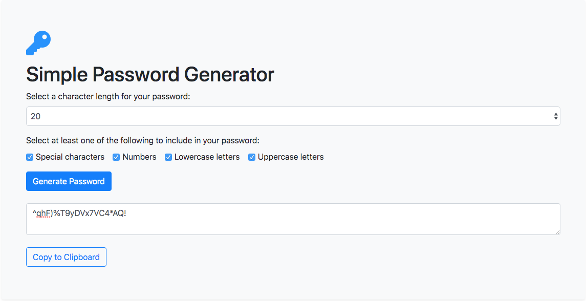

# Simple Password Generator

Author: Enid Soto

## Purpose of the project

This simple web application was created as an assignment for the Full Stack Bootcamp at the University of Miami in 2020. Its main purpose is to demonstrate some javascript skills learned during class lectures.

## Description

This web application uses javascript to generate a random password containing the following:

- Special Characters
- Uppercase and lowercase letters
- Numbers

The password is generated automatically after the user selects their desired criteria for the length and strength of the password. The new password will display in the page after the user clicks the "Generate Password" button.

The project is built in Bootstrap 4 and javascript.

## Functionality

Before the password generator function is called, the user must meet the following criteria:

- The character length is required, and must be between 8 and 128 digits. 
- Only one checkbox is required.
  
When the "Generate Password" button is clicked, it calls a function that checks if the above criteria is met. 

If no checkboxes are selected, an alert box displays a warning message. 

If at least one checkbox is selected, another function will be called. This function creates a new string that holds the special characters that have been selected, then using this custom string, it generates a new password containing the number of characters specified by the user in the "character length" select field. 

Finally, it displays the new password on the page and it gives the user the option to copy it to the clipboard. 

## User Interface

The application uses bootstrap 4 css classes for styling. It also includes an icon from [Font Awesome](https://fontawesome.com/).

This is a screenshot of the final application:

## Link to the deployed page

You can find the deployed application [here](https://enma1009.github.io/password-generator/).

